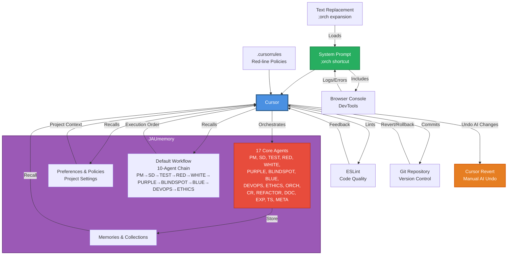

# System Architecture Diagram

## Components

1. **Cursor IDE** - Central hub
2. **System Prompt** - Orchestration trigger
3. **.cursorrules** - Policy enforcement
4. **JAUmemory** - Knowledge base containing:
   - 17 core agents:
     - **Workflow agents** (10): PM, SD, TEST, RED, WHITE, PURPLE, BLINDSPOT, BLUE, DEVOPS, ETHICS
     - **Specialized agents** (7): ORCH (orchestration), CR (code research), REFACTOR (optimization), DOC (documentation), EXP (UX/UI), TS (TypeScript), META (meta-learning/learning oversight)
   - Memories & Collections
   - Preferences & Policies (project-specific settings recalled at orchestration start)
   - Default Workflow (10-agent execution chain stored in JAUmemory)
5. **Browser Console** - Runtime diagnostics
6. **Git** - Version control (with revert/rollback capability)
7. **Cursor Revert** - Manual AI undo/rollback feature
8. **ESLint** - Code quality
9. **Text Replacement** - Productivity shortcut

## Visual Style Notes

- Use consistent iconography
- Show bidirectional data flow where applicable
- Highlight Cursor as the central orchestrator
- Use color coding: Blue (Cursor), Purple (JAUmemory), Red (Agents), Green (System Prompt), Orange (Cursor Revert)
- Show Default Workflow as embedded within JAUmemory, not as separate component
- Include labels for clarity
- Show both setup phase (configuration) and runtime phase (execution)

