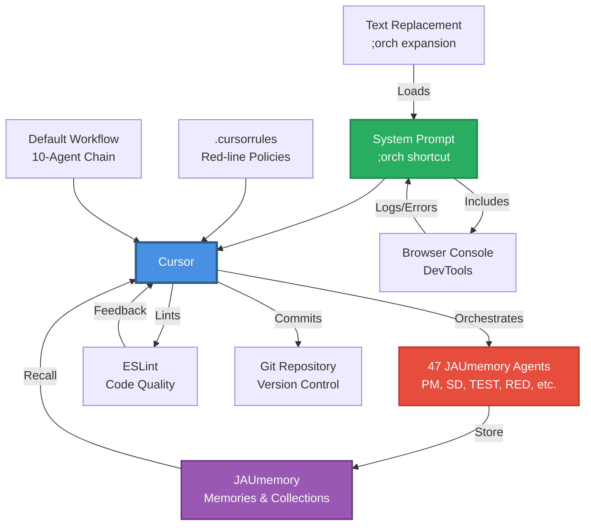

# System Architecture Diagram - Image Generation Prompt

Use this prompt with DALL-E, Midjourney, Stable Diffusion, or similar image generation tools to create a visual system diagram.

## Image Generation Prompt

```
Create a professional system architecture diagram showing an AI coding orchestration workflow. The diagram should show:

CENTRAL: Cursor IDE (large box in center) with "Multi-Agent Orchestration" label

CONNECTED TO CURSOR (radiating outward):
1. System Prompt (top) - text bubble with "Orch, initialize..." 
2. .cursorrules (top-right) - policy document icon
3. JAUmemory (right) - database/cloud icon with "47 Agents" and "Memories/Collections" labels
4. Browser Console (bottom-right) - DevTools window showing console/network tabs
5. Git Repository (bottom) - git branch icon with commit history
6. ESLint (bottom-left) - linting/checkmark icon
7. Text Replacement Tool (left) - keyboard shortcut icon with ";orch" label
8. Default Workflow (top-left) - flowchart showing "PM → SD → TEST → RED → WHITE → PURPLE → BLINDSPOT → BLUE → DEVOPS → ETHICS"

DATA FLOW ARROWS:
- System Prompt → Cursor (thick arrow)
- .cursorrules → Cursor (enforcement arrow)
- Cursor → JAUmemory (bidirectional, problem tracking)
- Browser Console → System Prompt (diagnostic data)
- Cursor → Git (commit arrow)
- ESLint → Cursor (error feedback)
- Text Replacement → System Prompt (expansion)
- Workflow → Cursor (execution order)

STYLE:
- Clean, modern, technical diagram
- Blue/purple color scheme
- Icons for each component
- Clear labels
- Professional software architecture aesthetic
- White background
- Arrows showing data flow and dependencies
```

## Alternative: Mermaid Diagram (Text-Based)

If you prefer a text-based diagram that can be rendered in Markdown:



## Components to Include

1. **Cursor IDE** - Central hub
2. **System Prompt** - Orchestration trigger
3. **.cursorrules** - Policy enforcement
4. **JAUmemory** - Knowledge base (47 agents, memories, collections)
5. **Browser Console** - Runtime diagnostics
6. **Git** - Version control
7. **ESLint** - Code quality
8. **Text Replacement** - Productivity shortcut
9. **Default Workflow** - 10-agent execution chain

## Visual Style Notes

- Use consistent iconography
- Show bidirectional data flow where applicable
- Highlight Cursor as the central orchestrator
- Use color coding: Blue (Cursor), Purple (JAUmemory), Red (Agents), Green (System Prompt)
- Include labels for clarity
- Show both setup phase (configuration) and runtime phase (execution)

